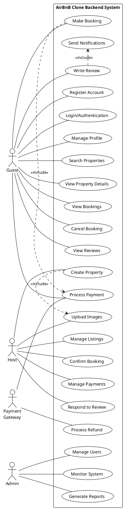

# AirBnB Clone Use Case Diagram

A comprehensive visualization of system interactions between users and the AirBnB Clone backend system, illustrating all key functionalities and actor relationships.

## 📋 Table of Contents

- [Overview](#overview)
- [Diagram Structure](#diagram-structure)
- [Actors and Roles](#actors-and-roles)
- [Use Cases by Category](#use-cases-by-category)
- [System Interactions](#system-interactions)
- [Relationship Types](#relationship-types)
- [Implementation Notes](#implementation-notes)
- [File Organization](#file-organization)
- [How to Create This Diagram](#how-to-create-this-diagram)

## 🎯 Overview

The Use Case Diagram provides a high-level view of the AirBnB Clone system functionality, showing how different types of users interact with the system to accomplish their goals. This diagram serves as a foundation for understanding system requirements and designing the user experience.

### Purpose
- **Visual Communication**: Clear representation of system functionality for stakeholders
- **Requirements Validation**: Ensures all user needs are captured
- **Design Foundation**: Basis for UI/UX design and API development
- **Testing Guide**: Reference for creating test scenarios and user acceptance criteria

### Scope
The diagram covers all primary interactions within the AirBnB Clone backend system, including:
- User registration and authentication
- Property management and search
- Booking and reservation processes
- Payment processing and financial transactions
- Review and rating system
- Administrative and monitoring functions

## 🏗️ Diagram Structure

### System Boundary
```
┌─────────────────────────────────────────────────────────────────┐
│                AirBnB Clone Backend System                      │
│                                                                 │
│  [All Use Cases Are Contained Within This Boundary]           │
│                                                                 │
└─────────────────────────────────────────────────────────────────┘
```

### Layout Organization
- **Left Side**: Primary actors (Guest, Host, Admin)
- **Center**: Use cases organized by functional categories
- **Right Side**: External systems (Payment Gateway)
- **Color Coding**: Each functional area has distinct colors for easy identification

## 👥 Actors and Roles

### 🟡 **Guest (End User)**
**Primary Role**: Property renter seeking accommodations

**Characteristics:**
- Most common user type
- Focuses on finding and booking properties
- Engages with payment and review systems
- May upgrade to Host role

**Goals:**
- Find suitable accommodations
- Complete bookings efficiently
- Make secure payments
- Share experiences through reviews

### 🟢 **Host (Property Owner)**
**Primary Role**: Property owner listing accommodations

**Characteristics:**
- Business-oriented user
- Manages multiple properties
- Inherits all Guest capabilities
- Revenue-focused interactions

**Goals:**
- List properties effectively
- Manage bookings and availability
- Maximize occupancy and revenue
- Maintain positive guest relationships

### 🔴 **Admin (System Administrator)**
**Primary Role**: Platform manager and moderator

**Characteristics:**
- Internal system user
- Oversight and control responsibilities
- Access to sensitive system functions
- Business intelligence focus

**Goals:**
- Maintain platform integrity
- Monitor system performance
- Generate business insights
- Resolve user disputes

### 🟣 **Payment Gateway (External System)**
**Primary Role**: Third-party payment processor

**Characteristics:**
- External service integration
- Financial transaction handling
- Security and compliance focused
- API-based interactions

**Responsibilities:**
- Process secure payments
- Handle refunds and chargebacks
- Validate payment methods
- Ensure PCI compliance

## 🎯 Use Cases by Category

### **1. User Management (Blue)**
| Use Case | Actor | Priority | Description |
|----------|-------|----------|-------------|
| Register Account | Guest, Host | High | Create new user account with role selection |
| Login/Authentication | All Users | High | Secure system access with JWT tokens |
| Manage Profile | All Users | Medium | Update personal information and preferences |

### **2. Property Management (Green)**
| Use Case | Actor | Priority | Description |
|----------|-------|----------|-------------|
| Search Properties | Guest | High | Find accommodations based on criteria |
| View Property Details | Guest | High | Access detailed property information |
| Create Property | Host | High | Add new property listing to platform |
| Manage Listings | Host | High | Edit, update, or delete property listings |
| Upload Images | Host | Medium | Add visual content to property listings |

### **3. Booking Management (Orange)**
| Use Case | Actor | Priority | Description |
|----------|-------|----------|-------------|
| Make Booking | Guest | High | Reserve property for specific dates |
| View Bookings | Guest, Host | High | Access booking history and details |
| Cancel Booking | Guest, Host | Medium | Cancel existing reservations |
| Confirm Booking | Host | High | Approve or decline booking requests |

### **4. Payment Processing (Purple)**
| Use Case | Actor | Priority | Description |
|----------|-------|----------|-------------|
| Process Payment | Guest, System | High | Handle financial transactions |
| Manage Payments | Host | Medium | View earnings and payout history |
| Process Refund | System, Admin | Medium | Handle booking cancellation refunds |

### **5. Review System (Red)**
| Use Case | Actor | Priority | Description |
|----------|-------|----------|-------------|
| Write Review | Guest | Medium | Provide feedback after stay |
| Respond to Review | Host | Medium | Reply to guest feedback |
| View Reviews | All Users | Low | Browse property and user reviews |

### **6. Administration (Pink)**
| Use Case | Actor | Priority | Description |
|----------|-------|----------|-------------|
| Manage Users | Admin | Medium | Oversee user accounts and permissions |
| Monitor System | Admin | High | Track system performance and health |
| Generate Reports | Admin | Low | Create business intelligence reports |

### **7. Notifications (Teal)**
| Use Case | Actor | Priority | Description |
|----------|-------|----------|-------------|
| Send Notifications | System | Medium | Automated user communications |

## 🔗 System Interactions

### **Primary User Journeys**

#### **Guest Booking Journey**
```
Register Account → Login → Search Properties → View Property Details 
     ↓
Make Booking → Process Payment → Receive Confirmation → Write Review
```

#### **Host Property Management Journey**
```
Register Account → Login → Create Property → Upload Images 
     ↓
Manage Listings → Confirm Bookings → Respond to Reviews → Manage Payments
```

#### **Admin Oversight Journey**
```
Login → Monitor System → Manage Users → Generate Reports
```

### **Cross-Actor Interactions**
- **Guest ↔ Host**: Through booking confirmations and reviews
- **System ↔ Payment Gateway**: For all financial transactions
- **Admin ↔ All Users**: Through system monitoring and user management
- **System ↔ All Users**: Through automated notifications

## 🔄 Relationship Types

### **Association Relationships (Solid Lines)**
- Direct interaction between actor and use case
- Actor initiates the use case
- Most common relationship type in the diagram

**Examples:**
- Guest → Make Booking
- Host → Create Property
- Admin → Generate Reports

### **Include Relationships (Dashed Lines)**
- Mandatory functionality that's part of another use case
- Base use case always triggers the included use case
- Represents system dependencies

**Examples:**
- Make Booking includes Process Payment
- Create Property includes Upload Images
- Write Review includes Send Notifications

### **Extend Relationships (Dashed Lines with <<extend>>)**
- Optional functionality that may be added to a base use case
- Conditional execution based on specific circumstances

**Examples:**
- Login extends to Two-Factor Authentication (if enabled)
- Search Properties extends to Save Search (if user chooses)
- Make Booking extends to Apply Discount (if applicable)

### **Generalization/Inheritance**
- Specialized actors inherit capabilities from general actors
- Represented by arrows pointing to the general actor

**Examples:**
- Host inherits all Guest capabilities
- Premium Guest inherits standard Guest capabilities

## 💻 Implementation Notes

### **API Endpoint Mapping**
Each use case corresponds to specific API endpoints:

```python
# User Management
POST /api/v1/auth/register     # Register Account
POST /api/v1/auth/login        # Login/Authentication
PUT  /api/v1/users/profile     # Manage Profile

# Property Management  
GET  /api/v1/properties/search # Search Properties
GET  /api/v1/properties/{id}   # View Property Details
POST /api/v1/properties        # Create Property

# Booking Management
POST /api/v1/bookings          # Make Booking
GET  /api/v1/bookings          # View Bookings
PUT  /api/v1/bookings/{id}     # Cancel/Confirm Booking

# Payment Processing
POST /api/v1/payments          # Process Payment
GET  /api/v1/payments/history  # Manage Payments
POST /api/v1/payments/refund   # Process Refund
```

### **Database Entity Relationships**
Use cases map to database operations:
- **Register Account** → User table INSERT
- **Create Property** → Property table INSERT + Address relationships
- **Make Booking** → Booking table INSERT + validation queries
- **Process Payment** → Payment table INSERT + external API calls

### **Security Considerations**
- **Authentication Required**: All use cases except registration require valid JWT
- **Authorization Levels**: Role-based access control for different actor types
- **Data Validation**: Input sanitization for all user-provided data
- **Audit Logging**: Track all significant user actions for security

### **Performance Implications**
- **High-Frequency Use Cases**: Search Properties, View Property Details
- **Resource-Intensive Operations**: Image uploads, payment processing
- **Caching Opportunities**: Property details, user profiles, search results
- **Async Processing**: Notifications, email sending, report generation

## 📁 File Organization

### **Repository Structure**
```
alx-airbnb-project-documentation/
├── use-case-diagram/
│   ├── README.md                    # This file
│   ├── use-case-diagram.png         # Main diagram image
│   ├── use-case-analysis.md         # Detailed analysis
│   ├── actor-descriptions.md        # Actor specifications
│   ├── use-case-scenarios.md        # Detailed scenarios
│   └── implementation-mapping.md    # Technical implementation notes
```

### **File Naming Conventions**
- **Main Diagram**: `airbnb-use-case-diagram.png`
- **Documentation**: Use descriptive, hyphenated names
- **Version Control**: Include version numbers for major updates

### **Documentation Standards**
- **Markdown Format**: All documentation in .md format
- **Consistent Styling**: Use headers, lists, and code blocks consistently
- **Cross-References**: Link related documents and sections
- **Visual Elements**: Include diagrams, tables, and code examples

## 🛠️ How to Create This Diagram

### **Method 1: Online Tools (Recommended)**

#### **Lucidchart** (Free tier available)
1. Go to [lucidchart.com](https://lucidchart.com)
2. Select "UML Use Case Diagram" template
3. Add actors using stick figure shapes
4. Add use cases using oval shapes
5. Connect with association lines
6. Add system boundary rectangle
7. Export as PNG

#### **Draw.io (Free)**
1. Go to [draw.io](https://draw.io)
2. Choose "UML" category
3. Drag actors and use case shapes
4. Connect with lines and arrows
5. Add colors and labels
6. Export as PNG

### **Method 2: Programming Approach**

#### **PlantUML** (Text-to-diagram)


### **Method 3: Simple Drawing Tools**

#### **Canva** (Free)
1. Create custom design (1200x800px)
2. Use circles for use cases
3. Use shapes for actors
4. Add text labels
5. Connect with lines
6. Export as PNG

#### **Google Drawings** (Free)
1. Access through Google Drive
2. Use shapes and text boxes
3. Draw connecting lines
4. Organize with colors
5. Download as PNG

### **Method 4: Desktop Software**

#### **Microsoft Visio**
- Professional UML templates
- Extensive shape libraries
- Advanced formatting options

#### **Lucidchart Desktop**
- Offline editing capability
- Team collaboration features
- Multiple export formats

## 🎨 Design Guidelines

### **Visual Standards**
- **Actors**: Stick figures with descriptive labels
- **Use Cases**: Ovals with concise, verb-phrase names
- **System Boundary**: Clear rectangle with system name
- **Colors**: Consistent color coding by functional area
- **Layout**: Logical grouping with adequate spacing

### **Naming Conventions**
- **Use Cases**: Start with verbs (e.g., "Make Booking", "Process Payment")
- **Actors**: Noun phrases (e.g., "Guest", "Payment Gateway")
- **Relationships**: Clear, descriptive labels when needed

### **Quality Checklist**
- [ ] All key actors identified
- [ ] Use cases cover all major functionality
- [ ] System boundary is clearly defined
- [ ] Relationships are accurate and complete
- [ ] Diagram is readable and well-organized
- [ ] Legend explains symbols and colors
- [ ] File is high resolution PNG format

## 🔍 Usage and Applications

### **Development Team**
- **Backend Developers**: API endpoint planning
- **Frontend Developers**: User interface requirements
- **Database Designers**: Entity relationship planning
- **QA Engineers**: Test case development

### **Business Stakeholders**
- **Product Managers**: Feature prioritization
- **Business Analysts**: Requirements validation
- **Project Managers**: Scope and timeline planning
- **Customer Support**: User journey understanding

### **Documentation Integration**
- Reference in technical specifications
- Include in user manual development
- Use for training materials
- Support API documentation

## 📈 Maintenance and Updates

### **Version Control**
- Track changes with descriptive commit messages
- Maintain changelog for major updates
- Archive previous versions
- Document rationale for changes

### **Review Cycle**
- **Monthly**: Review for completeness
- **Per Release**: Update with new features
- **Annually**: Comprehensive revision
- **As Needed**: Bug fixes and clarifications

### **Stakeholder Feedback**
- Collect input from development team
- Validate with business stakeholders
- Incorporate user experience insights
- Address technical implementation feedback

---